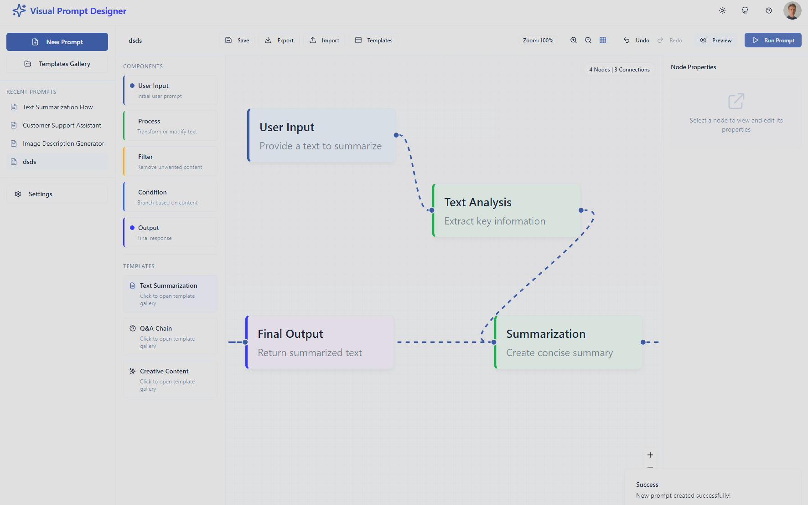

# Visual Prompt Craft 🧠✨


[](https://twitter.com/hamodywe)


> Design. Iterate. Perfect. A powerful visual tool for crafting AI prompts.


<p align="center">
  
</p>

## 📌 Overview

**Visual Prompt Craft** is an intuitive, drag-and-drop interface for designing complex AI prompts through a visual workflow. Turn your ideas into powerful, structured AI interactions with ease.

Create sophisticated prompt chains by connecting different types of nodes, manage prompt parameters, and generate high-quality AI results without writing complex prompt templates manually.

### 🚀 Demo


Try the live demo: [Visual Prompt Craft](https://visual-prompt-craft.vercel.app)

## ✨ Key Features

- **Visual Prompt Design** - Drag-and-drop interface for designing prompts
- **Node-Based Workflow** - Create complex prompt chains with different node types
- **Template Library** - Ready-made prompt templates for various use cases
- **Real-Time Preview** - See your prompt structure as you build
- **Parameter Management** - Define and manage variables within your prompts
- **Conditional Flows** - Create prompts with decision points and branches
- **Export & Import** - Share your prompt designs with others
- **AI Integration** - Direct OpenAI API integration for testing prompts
- **Conversation Import** - Import and convert conversations from ChatGPT or Claude
- **Enhanced Zoom Controls** - Zoom in/out and toggle grid for better visualization

## 🧩 Node Types

- **Input Nodes** - Define user inputs and context
- **Process Nodes** - Transform and analyze information
- **Filter Nodes** - Filter and route based on conditions
- **Condition Nodes** - Create branches based on logical conditions
- **Output Nodes** - Format and finalize AI responses

## 📚 Specialized Templates

### Development Templates
- **Code Review Assistant** - Helps with code review and suggestions
- **API Design Helper** - Assists with designing robust RESTful APIs
- **Debugging Assistant** - Helps analyze and fix code bugs
- **Software Architecture Designer** - Designs software architecture for new projects

### Content Creation Templates
- **Text Summarization** - Summarizes text content efficiently
- **Content Creation** - Generate professional blog posts and articles
- **Q&A Chain** - Answer questions based on provided context

### Analysis Templates
- **Sentiment Analysis** - Analyze sentiment and emotions in text
- **Idea Generation** - Generate creative ideas for various purposes

## 🛠️ Technologies Used

- **Frontend**: React, TypeScript, ReactFlow, Tailwind CSS, shadcn/ui
- **Backend**: Express, Node.js
- **State Management**: React Query, Custom Hooks
- **Styling**: Tailwind CSS with custom theme
- **AI Integration**: OpenAI API, Anthropic Claude API support

## 🚀 Getting Started

### Prerequisites

- Node.js (v16+)
- npm or yarn

### Installation

1. Clone the repository
```bash
git clone https://github.com/hamodywe/Visual-Prompt-Craft.git
cd Visual-Prompt-Craft
```

2. Install dependencies
```bash
npm install
# or
yarn install
```

3. Start the development server
```bash
npm run dev
# or
yarn dev
```

4. Open your browser and visit `http://localhost:5000`

## 📚 Documentation

For detailed documentation, visit our [Wiki](https://github.com/hamodywe/Visual-Prompt-Craft/wiki) page.

### User Guides
- [Getting Started Guide](https://github.com/hamodywe/Visual-Prompt-Craft/wiki/Getting-Started)
- [Creating Your First Prompt](https://github.com/hamodywe/Visual-Prompt-Craft/wiki/First-Prompt)
- [Advanced Techniques](https://github.com/hamodywe/Visual-Prompt-Craft/wiki/Advanced-Techniques)

### Developer Guides
- [Architecture Overview](https://github.com/hamodywe/Visual-Prompt-Craft/wiki/Architecture)
- [Contributing](https://github.com/hamodywe/Visual-Prompt-Craft/wiki/Contributing)
- [Creating Custom Nodes](https://github.com/hamodywe/Visual-Prompt-Craft/wiki/Custom-Nodes)

## 🤝 Contributing

Contributions are welcome! Please feel free to submit a Pull Request.

1. Fork the repository
2. Create your feature branch (`git checkout -b feature/amazing-feature`)
3. Commit your changes (`git commit -m 'Add some amazing feature'`)
4. Push to the branch (`git push origin feature/amazing-feature`)
5. Open a Pull Request

See the [Contributing Guide](https://github.com/hamodywe/Visual-Prompt-Craft/wiki/Contributing) for more information.

## 📝 License

This project is licensed under the MIT License - see the [LICENSE](LICENSE) file for details.

## 📞 Contact

- **GitHub**: [@hamodywe](https://github.com/hamodywe)
- **Email**: ios9.apk@gmail.com

---

<p align="center">
  Made with ❤️ by <a href="https://github.com/hamodywe">hamodywe</a>
</p>

<p align="center">
  <a href="https://github.com/hamodywe/Visual-Prompt-Craft/stargazers">⭐ Star us on GitHub</a>
</p>
